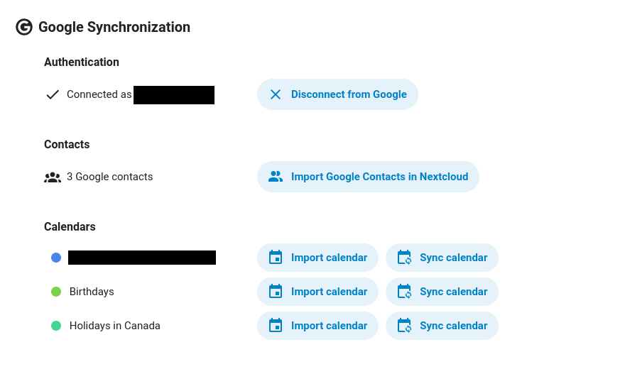

# Google Synchronization

**This is a fork of the [Google Integration][integration_google] app. Do not use both at the same time!!**

**Use at your own risk. This app is still in early development. Users are effectively beta testers.**

If all you need to do is import all of your data from Google once and permanently migrate to Nextcloud (lucky you),
you should use the [Google Integration][integration_google] app (of which this app is a fork).

However, if you're like me, you're part of a team or group that has shared a Google Calendar with you,
and you would like to keep it up to date with your Nextcloud calendar.
That's exactly what this app does.

This is a fork of [Google Integration][integration_google]
that creates a background task that will periodically import all changes from Google Calendar to your Nextcloud calendar.
As such, all functionality of [Google Integration][integration_google]
is still implemented, so you can still import Contacts, Photos, Drive manually.
However, currently, **only Google Calendar background synchronization is supported**.
Please let me know if you would like to continuously synchronize other services.
This also means that this app should not be used at the same time as [Google Integration][integration_google].

This is a one-way synchronization.
Events from Google Calendar are imported into Nextcloud,
but events from Nextcloud are not sent to Google.

This App supports:
1. **New events**: Adding a new event in Google Calendar will create a new event in Nextcloud Calendar
1. **Modified events**: Modifying an event in Google Calendar will modify the event in Nextcloud Calendar
1. **Deleted events**: Well, you get it by now
1. **Calendars you own**
1. **Calendars that have been shared with you**

## ⚠️ Disclaimers

- **If you own the Google Calendar**, you are probably better off **NOT** using this app and instead copying the private ical address and importing it into Nextcloud Calendar as a read-only subscription. This fork was created because I was part of a team and I did not own the Google Calendar in order to get this private address.
- This app only synchronizes events **from Google to Nextcloud**, it does **NOT** synchronize events from your Nextcloud Calendar into your Google Calendar.

[integration_google]: https://github.com/nextcloud/integration_google

## 🚀 Installation

In your Nextcloud, simply enable the Google Synchronization app through the Apps management.
The Google Synchronization app is available for Nextcloud >= 22.

## 🔧 Setup

The app needs some setup in the Google API Console in order to work.
To do this, go to Nextcloud Settings > Administration > Connected accounts and follow the instructions in the "Google Synchronization" section.

After setting up the Google API, head to Nextcloud Settings > Data Migration.

The first time coming here, you should only see one button "Sign in with Google".
Click this, and follow the prompts.
Give access to everything requested (the app does not handle missing permissions gracefully).

## 🔥 Usage

Once signed in, you can import data and change settings by going to Nextcloud Settings > Google Synchronization.

This page is equivalent to [Google Integration][integration_google]
with the exception of the buttons "Sync calendar" next to each calendar.
- "Import calendar" is the same as [Google Integration][integration_google]. It will manually import all events from the calendar once.
- "Sync calendar" will schedule a background job to continuously synchronize all events from that calendar with your Nextcloud calendar. This job should run every time background jobs run (Nextcloud Settings > Administration > Basic settings > Background jobs).



## Versioning

The following table shows the version of this app compared to the upstream version it's based on.
I was previously using the 3 semver digits to show the upstream version and `-n` to show how many releases I had made to this fork on top of that,
but it caused my releases to not be installable through the Nextcloud UI.
Going forward, I will use a semver version and I will keep this table up to date to show the version it's based on.
This also allows me to decide for myself if my releases are major, minor, or patch.

| Google Synchronization version | Google Integration version |
| ------------------------------ | -------------------------- |
| 3.0.0                          | 3.1.0                      |
| 2.2.0                          | 2.2.0                      |
| 2.1.1                          | 2.1.0                      |
| 2.1.0-2-nightly                | 2.1.0                      |
| 2.1.0-1                        | 2.1.0                      |
| 1.0.9.0                        | 1.0.9                      |

## **🛠️ State of maintenance**

While there are many things that could be done to further improve this app, the app is currently maintained with **limited effort**. This means:

- The main functionality works for the majority of the use cases
- We will ensure that the app will continue to work like this for future releases and we will fix bugs that we classify as 'critical'
- We will not invest further development resources ourselves in advancing the app with new features
- We do review and enthusiastically welcome community PR's

We would be more than excited if you would like to collaborate with us. We will merge pull requests for new features and fixes. We also would love to welcome co-maintainers.

If there is a strong business case for any development of this app, we will consider your wishes for our roadmap. Please [contact your account manager](https://nextcloud.com/enterprise/) to talk about the possibilities.

## Development guide

1. Setup Nextcloud development environment (such as [nextcloud-docker-dev](https://github.com/juliushaertl/nextcloud-docker-dev))
1. Install the files for this app in the development environment (I like to modify the `nextcloud-docker-dev` `docker-compose.yml` file and add a volume like this: `- ../google_synchronization:/var/www/html/apps/google_synchronization:ro`. Please read that project's README for alternative methods.)
1. Install PHP dependencies (install [Composer](https://getcomposer.org/), run `composer install`)
1. Install Node dependencies (install [Node.js](https://nodejs.org/en/), run `npm install`)
1. Build JavaScript bundle: `npm run dev` or `npm run watch`
1. Enable the app. Go to the apps page in your development version of Nextcloud, find "Google Synchronization", and click "Enable"
<!-- sudo docker run --rm -p 8080:80 -v /home/marcel/code/google_synchronization:/var/www/html/apps/google_synchronization:ro ghcr.io/juliushaertl/nextcloud-dev-php81:latest -->

### Logging

The easiest way I've found for simple logging is just to append to a file in `/tmp`.
1. Add some logs:
    ```php
    file_put_contents("/tmp/bal", "Hello world", FILE_APPEND);
    ```
1. Connect to the container (if you're using `nextcloud-docker-dev`):
    ```
    docker exec -it master_stable28_1 bash
    ```
1. Tail the log file:
    ```
    tail -f /tmp/blah
    ```

This is unorthodox, but easier than using the Nextcloud logging mechanism.
- Only shows you your messages
- Don't have to figure out how to view the official logs
- Don't have to deal with JSON
- Don't have to instantiate the logger everywhere in the code

### Database

1. `sudo docker exec -it master_database-mysql_1 bash`
1. `mysql -u nextcloud -d nextcloud -p`


### Creating a release

#### Packaging a release

1. Update `CHANGELOG.md`, `appinfo/info.xml`, and `package.json` with the new version
1. Create a Git tag
1. Run the following:
    ```
    make build
    version=<version> make appstore  # will create a tar.gz in ./build/artifacts/appstore/*.tar.gz
    ```

#### Publishing a release

1. Create a GitHub release and attach the tar.gz
1. Obtain a signature of the archive:
    ```
    openssl dgst -sha512 -sign ~/.nextcloud/certificates/google_synchronization.key \
        build/artifacts/appstore/*.tar.gz | openssl base64
    ```
1. Go to https://apps.nextcloud.com/developer/apps/releases/new. Paste the signature and the link to the file from the GitHub release.

[Relevant guide](https://nextcloudappstore.readthedocs.io/en/latest/developer.html#uploading-an-app-release)
